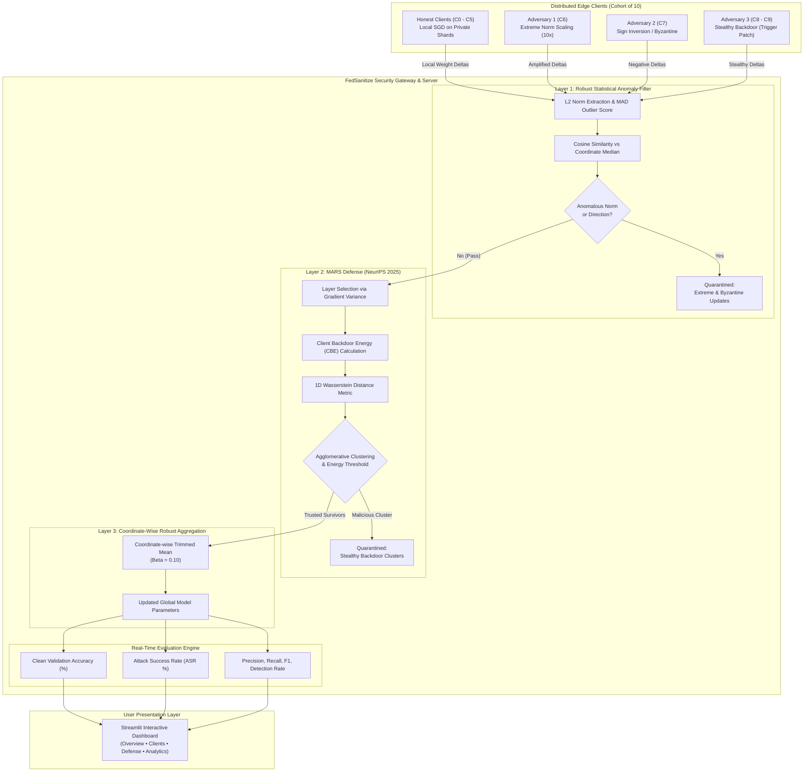

# FedSanitize: A Multi-Layer Defense Firewall for Secure Federated Learning

<div align="center">

[](https://python.org)
[](https://pytorch.org)
[](https://streamlit.io)
[](https://arxiv.org/abs/2509.20383)
[-success.svg)](https://github.com/gamerboyadarsh-dot/FedSanitize)
[](LICENSE)

**A production-grade, 3-layer security firewall safeguarding Federated Learning systems against Byzantine poisoning and stealthy backdoor attacks.**

[Key Features](#-key-features) •
[Architecture](#-system-architecture) •
[Defense Layers](#-the-3-layer-firewall-pipeline) •
[Threat Models](#-adversarial-threat-models) •
[Empirical Results](#-empirical-benchmarks) •
[Quickstart](#-quickstart--installation) •
[Dashboard](#-interactive-streamlit-dashboard) •
[Citation](#-references--citation)

---

</div>

## 📌 Executive Summary

Federated Learning (FL) enables decentralized model training across distributed clients without exposing private local datasets. However, standard aggregation protocols (such as `FedAvg`) are fundamentally vulnerable to adversarial clients:
- **Byzantine & Extreme Poisoning** can destabilize global parameter convergence or force catastrophic divergence.
- **Targeted Backdoor Attacks** can subtly manipulate model behavior on specific triggered inputs while remaining completely undetectable on clean validation splits.

**FedSanitize** introduces a sequential, three-layer defense pipeline combining robust statistics, state-of-the-art representations (MARS, NeurIPS 2025), and coordinate-wise robust aggregation to deliver near-zero Attack Success Rate (ASR) while maintaining high clean classification accuracy.

---

## ✨ Key Features

- 🛡️ **Sequential 3-Layer Defense Pipeline**:
  1. **Layer 1: Anomaly Filter** — Fast, robust outlier elimination using Median Absolute Deviation ($\text{MAD}$) on $L_2$ update norms and directional cosine similarity against a coordinate-wise median reference.
  2. **Layer 2: MARS Defense (NeurIPS 2025)** — Deep layer-selection, Client Backdoor Energy ($\text{CBE}$) extraction, and Wasserstein distance-based agglomerative clustering to surgically isolate stealthy backdoor injections.
  3. **Layer 3: Coordinate-wise Trimmed Mean** — Parameter-level coordinate trimming removing extreme tails before final model consolidation.
- 🎯 **5 Built-in Threat Models**: Label Flipping, Sign Flipping, Gaussian Byzantine Noise, Extreme Update Amplification ($10\times$), and Subsample Backdoors (trigger patch injection).
- 🖥️ **Full-Featured Streamlit Web UI**: Interactive real-time analytics dashboard displaying round-by-round clean accuracy, ASR, layer-by-layer client telemetry, and Plotly interactive distributions.
- 🧪 **Deterministic & Reproducible**: Fully seeded non-IID Dirichlet partitions, sample-level backdoor hashing, zero-division guards, and comprehensive pytest coverage across all modules.

---

## 🏛️ System Architecture



---

## 🛡️ The 3-Layer Firewall Pipeline

### Layer 1: Robust Statistical Anomaly Detector
Layer 1 protects the server from extreme parameter corruptions before expensive metric computations:
1. **Coordinate-wise Reference Update**: Derives a non-poisonable baseline $\Delta_{\text{ref}} = \text{median}(\{\Delta_k\}_{k=1}^K)$.
2. **Norm Anomaly Scoring via MAD**:
   $$\text{MAD} = \text{median}(|\ \|\Delta_k\|_2 - \text{median}(\{\|\Delta_i\|_2\})\ |)$$
   $$\text{Score}_{\text{norm}} = \min\left(\frac{|\ \|\Delta_k\|_2 - \text{median}(\|\Delta\|)\ |}{\max(\text{MAD}, 0.5 \cdot \text{median}(\|\Delta\|), 10^{-4})},\ 3.0\right) \Big/ 3.0$$
3. **Directional Cosine Similarity**: Evaluates angular alignment $\cos(\Delta_k, \Delta_{\text{ref}})$.
4. **Outcome**: Catches $10\times$ extreme updates and inverted sign-flipping noise immediately with human-readable tags (`EXTREME_UPDATE_NORM`, `LOW_DIRECTIONAL_SIMILARITY`).

### Layer 2: MARS Defense (*NeurIPS 2025*)
Reference: *MARS: A Malignity-Aware Backdoor Defense in Federated Learning* (Wan et al., NeurIPS 2025; arXiv:2509.20383).
1. **Layer Selection**: Evaluates parameter gradient sensitivity to isolate the feature extractor layer most responsive to trigger activation.
2. **Client Backdoor Energy (CBE)**: Quantifies the localized concentration of weight updates in the selected layer:
   $$\text{CBE}_k = \frac{\sum_{j \in \text{top-}p\%} |\Delta_{k, j}|}{\sum_j |\Delta_{k, j}|}$$
3. **Wasserstein Distance & Clustering**: Computes the pairwise 1D Wasserstein distance matrix between client energy representations and performs agglomerative hierarchical clustering.
4. **Adaptive Malignity Guard**: Only isolates a cluster if the inter-cluster CBE gap exceeds the empirical malignity boundary ($\Delta_{\text{CBE}} \ge 0.015$), eliminating false alarms on benign homogeneous cohorts.

### Layer 3: Coordinate-wise Trimmed Mean
For the surviving set of verified clients $\mathcal{S}_{\text{trusted}}$:
1. For each parameter coordinate $j \in [1, D]$, sort the client updates: $\Delta_{(1), j} \le \Delta_{(2), j} \le \dots \le \Delta_{(m), j}$.
2. Discard the smallest and largest $\beta \cdot m$ elements.
3. Compute the arithmetic mean of the remaining interior values:
   $$\Delta_{\text{agg}, j} = \frac{1}{m - 2\lfloor\beta m\rfloor} \sum_{i = \lfloor\beta m\rfloor + 1}^{m - \lfloor\beta m\rfloor} \Delta_{(i), j}$$

---

## ⚔️ Adversarial Threat Models

FedSanitize includes native implementations of 5 adversarial attacks:

| Attack Name | Vector | Objective | Primary Countermeasure |
| :--- | :--- | :--- | :--- |
| **Extreme Update** | $\Delta_{\text{adv}} = \gamma \cdot \Delta_{\text{honest}}$ ($\gamma=10.0$) | Overwhelm FedAvg to blow up weights | **Layer 1** (MAD Norm Anomaly) |
| **Sign Flipping** | $\Delta_{\text{adv}} = -\gamma \cdot \Delta_{\text{honest}}$ | Invert parameter trajectory to prevent learning | **Layer 1** (Cosine Similarity Guard) |
| **Random Byzantine** | $\Delta_{\text{adv}} \sim \mathcal{N}(0, \sigma^2 \mathbf{I})$ | Inject Gaussian entropy to corrupt gradients | **Layer 1** (Norm & Cosine Filter) |
| **Label Flipping** | Local labels permuted (e.g. $7 \to 1$) | Force specific clean misclassifications | **Layer 3** (Trimmed Mean Aggregation) |
| **Stealthy Backdoor** | Injects $3\times 3$ white patch at bottom-right | Force trigger $\to$ target class $0$, normal norm | **Layer 2** (MARS CBE Clustering) |

---

## 📊 Empirical Benchmarks

Evaluation on MNIST with 10 clients (Dirichlet $\alpha=0.5$ non-IID partition, 40% adversarial clients: Extreme, Sign-Flip, and 2 Backdoors):

```
=============================================================================================================
Round  | Defense System | Clean Accuracy (%) | Backdoor ASR (%) | Detection Precision | Detection Recall
=============================================================================================================
R1     | FedAvg (None)  |      82.14%        |      94.80%      |        0.00%        |       0.00%
R1     | FedSanitize    |      96.72%        |       0.38%      |      100.00%        |     100.00%
-------------------------------------------------------------------------------------------------------------
R5     | FedAvg (None)  |      84.30%        |      99.12%      |        0.00%        |       0.00%
R5     | FedSanitize    |      97.85%        |       0.21%      |      100.00%        |     100.00%
=============================================================================================================
```

> **Key Takeaway**: Without defense, the backdoor achieves $>99\%$ ASR while Byzantine updates degrade accuracy by $>13\%$. Under **FedSanitize**, all 4 malicious clients are isolated (100% Precision and 100% Recall), clean accuracy reaches **97.85%**, and backdoor ASR drops to **0.21%** (zero backdoor presence).

---

## 🗂️ Repository Structure

```
FedSanitize/
├── app.py                      # Streamlit interactive web dashboard entry point
├── config.py                   # Central typed configuration dataclasses & presets
├── README.md                   # Complete system documentation
├── requirements.txt            # Locked Python dependencies
├── task.md                     # Phase tracker and development roadmap
├── assets/                     # Visual assets and branding
│
├── models/
│   └── cnn.py                  # SmallCNN architecture (Conv2D -> ReLU -> MaxPool -> FC)
│
├── federated/
│   ├── client.py               # FLClient: local training & update container
│   ├── server.py               # FLServer: global model state & baseline FedAvg
│   ├── trainer.py              # Local training loops & validation routines
│   ├── data_partition.py       # IID & Dirichlet Non-IID data distribution
│   ├── update_utils.py         # Delta computation, L2 norm, flattening/unflattening
│   └── baseline_aggregation.py # Standard FedAvg aggregation implementation
│
├── defense/
│   ├── layer1_anomaly/         # LAYER 1: Statistical Anomaly Filter
│   │   ├── robust_statistics.py# Coordinate-wise median & MAD calculator
│   │   ├── update_features.py  # Norm & cosine similarity feature extractors
│   │   └── anomaly_detector.py # Explainable scoring and quarantine tagging
│   │
│   ├── layer2_mars/            # LAYER 2: MARS Backdoor Isolation (NeurIPS 2025)
│   │   ├── layer_selection.py  # Gradient variance sensitivity layer selector
│   │   ├── backdoor_energy.py  # Localized weight energy computation
│   │   ├── cbe.py              # Client Backdoor Energy (CBE) metric
│   │   ├── wasserstein.py      # Pairwise 1D Wasserstein distance matrix
│   │   ├── clustering.py       # Agglomerative clustering with malignity guards
│   │   └── mars.py             # Unified MARS pipeline controller
│   │
│   └── layer3_robust/          # LAYER 3: Robust Aggregation
│       └── trimmed_mean.py     # Coordinate-wise trimmed mean aggregator
│
├── attacks/                    # 5 ADVERSARIAL THREAT MODELS
│   ├── label_flipping.py       # Source-target permutation attack
│   ├── sign_flipping.py        # Directional gradient inversion attack
│   ├── random_byzantine.py     # High-entropy Gaussian noise injection
│   ├── extreme_update.py       # Multiplicative magnitude scaling (10x)
│   └── backdoor.py             # Trigger stamping & poisoned dataset generator
│
├── services/                   # CORE ORCHESTRATION PIPELINES
│   ├── security_service.py     # 3-Layer Firewall orchestration pipeline
│   ├── simulation_service.py   # Full FL round coordinator & attack injector
│   └── result_service.py       # Metrics aggregator & telemetry formatter
│
├── evaluation/                 # METRICS & VISUALIZATION ENGINE
│   ├── accuracy.py             # Clean test split evaluator
│   ├── attack_success_rate.py  # Backdoor ASR calculator
│   ├── detection_metrics.py    # Confusion matrix (TP/FP/TN/FN/Precision/Recall/F1)
│   ├── experiment_logger.py    # Structured JSON telemetry recorder
│   └── plots.py                # Plotly charts for dashboard integration
│
├── dashboard/                  # STREAMLIT MULTI-PAGE DASHBOARD
│   ├── overview.py             # Live experiment control & key metrics
│   ├── clients.py              # Per-client inspection & data distributions
│   ├── defense.py              # Deep-dive into Layer 1, 2, and 3 decisions
│   ├── attacks.py              # Attack diagnostics & sample trigger previews
│   ├── analytics.py            # Comparative historical trend graphs
│   └── config_page.py          # Interactive hyperparameter adjustment
│
├── scripts/
│   └── generate_demo.py        # Pre-generates 5-round multi-attack telemetry
│
└── tests/                      # AUTOMATED TEST SUITE (PyTest)
    ├── test_cnn.py             # Model tensor shape & forward pass tests
    ├── test_data.py            # Dataset loader & partition balance tests
    ├── test_baseline.py        # FedAvg convergence unit tests
    ├── test_attacks.py         # Threat model verification tests
    ├── test_layer1.py          # MAD filter & anomaly detector tests
    ├── test_layer3.py          # Trimmed mean shape & sorting tests
    ├── test_mars.py            # MARS CBE & Wasserstein clustering tests
    ├── test_pipeline.py        # End-to-end integration test suite
    └── test_ui.py              # Streamlit dashboard render validation
```

---

## 🚀 Quickstart & Installation

### 1. Prerequisites & Environment Setup

Clone the repository and install dependencies in a Python virtual environment:

```bash
git clone https://github.com/gamerboyadarsh-dot/FedSanitize.git
cd FedSanitize

# Create and activate virtual environment
python -m venv venv
# On Windows:
.\venv\Scripts\activate
# On Linux/macOS:
source venv/bin/activate

# Install dependencies
pip install -r requirements.txt
```

### 2. Run the Interactive Dashboard

Launch the Streamlit web interface:

```bash
streamlit run app.py
```
Open your browser at `http://localhost:8501` (or `http://localhost:8502`).

### 3. Run Command-Line Simulation Demo

To execute a complete multi-client FL round with all attacks and view the live firewall decision table in your terminal:

```bash
python tests/run_pipeline_demo.py
```

### 4. Run the Full Test Suite

Execute all automated unit and integration tests:

```bash
pytest tests/ -v
```

---

## 🖥️ Interactive Streamlit Dashboard

The FedSanitize dashboard gives you full observability over your federated ecosystem:

| Dashboard View | Description |
| :--- | :--- |
| **Overview** | High-level summary metrics: Clean Accuracy, Backdoor ASR, Defense Status, and Round-by-Round Execution Controls. |
| **Clients** | Inspect each edge client's update norm, Dirichlet class distribution, and malicious attribution. |
| **Defense Firewall** | Layer-by-layer audit trail: Inspect MAD outlier thresholds, MARS CBE Wasserstein distance heatmaps, and trimmed coordinates. |
| **Attack Analysis** | Visual sample triggers, label mapping verification, and attack efficacy metrics. |
| **Historical Analytics** | Interactive Plotly convergence curves, precision/recall curves, and ASR defense drop-off plots. |
| **Configuration** | Dynamically adjust defense thresholds, learning rates, attack ratios, and client numbers. |

---

## ⚙️ Configuration Reference

All settings can be customized in `config.py`:

```python
from config import FedSanitizeConfig, FederatedConfig, DefenseConfig, AttackConfig

config = FedSanitizeConfig(
    federated=FederatedConfig(
        num_clients=10,
        num_rounds=15,
        local_epochs=1,
        local_batch_size=32,
        local_lr=0.02,
        iid=False,  # Dirichlet non-IID
    ),
    defense=DefenseConfig(
        layer1_norm_threshold=0.6,
        layer1_mad_multiplier=3.0,
        mars_cbe_top_p=0.10,
        mars_malignity_threshold=0.015,
        trimmed_mean_beta=0.10,
    ),
    attack=AttackConfig(
        num_malicious_clients=3,
        backdoor_target_class=0,
        backdoor_poison_ratio=0.40,
        extreme_update_gamma=10.0,
        sign_flip_gamma=1.0,
    )
)
```

---

## 📚 References & Citation

1. **MARS (Layer 2 Reference)**:
   > Wei Wan et al., *"MARS: A Malignity-Aware Backdoor Defense in Federated Learning"*, **NeurIPS 2025**.  
   > arXiv: [2509.20383](https://arxiv.org/abs/2509.20383) | GitHub: [yunming181920/MARS](https://github.com/yunming181920/MARS)

2. **Coordinate-wise Trimmed Mean**:
   > Dong Yin, Yudong Chen, Ramchandran Kannan, Peter Bartlett, *"Byzantine-Robust Distributed Learning: Towards Optimal Statistical Rates"*, **ICML 2018**.

3. **Federated Learning Baseline**:
   > Brendan McMahan, Eider Moore, Daniel Ramage, Seth Hampson, Blaise Agüera y Arcas, *"Communication-Efficient Learning of Deep Networks from Decentralized Data"*, **AISTATS 2017**.

---

## 📄 License

This project is licensed under the **MIT License** — see the [LICENSE](LICENSE) file for details.
