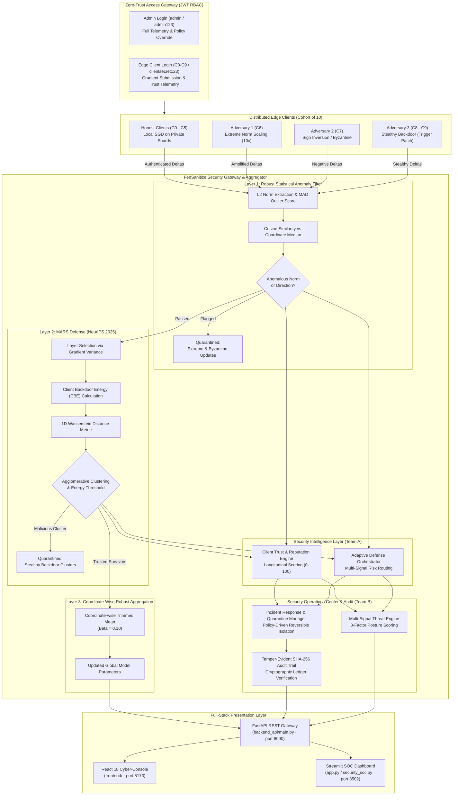

# FedSanitize: A Multi-Layer Defense Firewall for Secure Federated Learning

<div align="center">

[](https://python.org)
[](https://pytorch.org)
[](https://react.dev)
[](https://fastapi.tiangolo.com)
[](https://vitejs.dev)
[](https://arxiv.org/abs/2509.20383)
[](https://github.com/gamerboyadarsh-dot/FedSanitize)
[](https://github.com/gamerboyadarsh-dot/FedSanitize)
[](https://github.com/gamerboyadarsh-dot/FedSanitize)
[](LICENSE)

**A production-grade, 3-layer security firewall safeguarding Federated Learning systems against Byzantine poisoning and stealthy backdoor attacks — augmented with Zero-Trust JWT access control, autonomous security intelligence, tamper-evident SHA-256 audit chaining, and dual React + Streamlit SOC dashboards.**

[Key Features](#-key-features) •
[Architecture](#-system-architecture) •
[Defense Layers](#-the-3-layer-firewall-pipeline) •
[Security Intelligence & SOC](#-security-intelligence-zero-trust--soc-operations) •
[Threat Models](#-adversarial-threat-models) •
[Empirical Results](#-empirical-benchmarks) •
[Quickstart](#-quickstart--installation) •
[Dashboard Surfaces](#-dashboard-presentation-surfaces) •
[File Directory & Theory](#-deep-dive-file-by-file-technical-directory--theory) •
[Cloud Deployment](DEPLOYMENT.md) •
[Citation](#-references--citation)

---

</div>

## 🚀 Live Deployments

- **Frontend Console (React)**: [https://fed-sanitize.vercel.app](https://fed-sanitize.vercel.app)
- **Backend API (FastAPI)**: [Insert your Railway backend URL here]

## 📌 Executive Summary

Federated Learning (FL) enables decentralized model training across distributed clients without exposing private local datasets. However, standard aggregation protocols (such as `FedAvg`) are fundamentally vulnerable to adversarial clients:
- **Byzantine & Extreme Poisoning** can destabilize global parameter convergence or force catastrophic divergence.
- **Targeted Backdoor Attacks** can subtly manipulate model behavior on specific triggered inputs while remaining completely undetectable on clean validation splits.

**FedSanitize** introduces a sequential, three-layer defense pipeline combining robust statistics, state-of-the-art representations (MARS, NeurIPS 2025), and coordinate-wise robust aggregation to deliver near-zero Attack Success Rate (ASR) while maintaining high clean classification accuracy.

Beyond aggregation defense, FedSanitize incorporates an enterprise-grade **Security Intelligence Layer** featuring:
1. **Zero-Trust Access Gateway**: Asymmetric Ed25519 & HS256 JWT role-based access control (Admin vs. Edge Client).
2. **Dynamic Client Trust & Reputation Engine (Team A)**: Exponential reputation tracking with multi-incident escalation penalties.
3. **Adaptive Defense Orchestrator (Team A)**: Multi-signal risk assessment with 4-tier autonomous defense routing.
4. **Tamper-Evident Audit Trail (Team B)**: Cryptographically chained SHA-256 ledger guaranteeing audit integrity and zero model leakage.
5. **Policy-Driven Incident Response (Team B)**: Automated, reversible quarantine lifecycle with strict no-deletion guarantees.
6. **Dual Presentation Surfaces**: A flagship **React 18 + TypeScript Cyber-Console** alongside a standalone **Streamlit Security Operations Center (SOC)**.

---

## ✨ Key Features

- 🛡️ **Sequential 3-Layer Defense Pipeline**:
  1. **Layer 1: Anomaly Filter** — Fast, robust outlier elimination using Median Absolute Deviation ($\text{MAD}$) on $L_2$ update norms and directional cosine similarity against a coordinate-wise median reference.
  2. **Layer 2: MARS Defense (NeurIPS 2025)** — Deep layer-selection, Client Backdoor Energy ($\text{CBE}$) extraction, and Wasserstein distance-based agglomerative clustering to surgically isolate stealthy backdoor injections.
  3. **Layer 3: Coordinate-wise Trimmed Mean** — Parameter-level coordinate trimming removing extreme tails before final model consolidation.
- 🔐 **Zero-Trust Access Gateway & RBAC**: Dual-algorithm cryptographic JWT engine (Ed25519 / HS256) enforcing role separation between Central Admin and Edge Clients (`C0–C9`) with interactive credential modals and demo credentials.
- 🎖️ **Dynamic Client Trust & Reputation Engine (Feature 1)**: Computes longitudinal client reliability across training rounds with graduated trust tiers (`TRUSTED`, `MONITORED`, `SUSPICIOUS`, `HIGH_RISK`, `QUARANTINED`).
- 🧭 **Adaptive Defense Orchestrator (Feature 2)**: Synthesizes Layer 1, MARS, CBE ratios, and client trust into a normalized round threat score with 4-tier defense routing (`STANDARD`, `HEIGHTENED_MONITORING`, `ISOLATE_SUSPECTS`, `EMERGENCY_FALLBACK`).
- 🔗 **Tamper-Evident SHA-256 Audit Trail (Team B)**: Every security event, anomaly detection, and quarantine action is cryptographically hash-chained ($H_k = \text{SHA256}(H_{k-1} \parallel E_k \parallel T_k \parallel P_k)$) with automatic tamper detection and zero-model-leakage sanitization.
- 🔒 **Policy-Driven Reversible Incident Response (Team B)**: Automated quarantine lifecycle (`MONITOR`, `REDUCE_WEIGHT`, `TEMPORARY_ISOLATE`, `QUARANTINE`) with strict no-deletion guarantees and round-based automated expiration.
- ⚔️ **5 Built-in Threat Models**: Label Flipping, Sign Flipping, Gaussian Byzantine Noise, Extreme Update Amplification ($10\times$), and Subsample Backdoors (trigger patch injection).
- 🏟️ **Interactive Live Attack Arena**: Real-time interactive simulation sandbox supporting scenario replay, dynamic network topologies, and per-client forensic dossiers.
- 🖥️ **Dual Presentation Surfaces**:
  - **React 18 + TypeScript Cyber-Console**: Sleek Dark-Cyber theme (Void Black `#050508`, Signal Cyan `#38FBDB`, Stealth Purple `#8E52F5`), Framer Motion transitions, interactive trigger matrices, and sub-tab SOC switcher.
  - **Streamlit SOC & Multi-Page Dashboard**: Standalone SOC page (`dashboard/security_soc.py`) and multi-page operational suite (`app.py` on `:8502`).
- 🧪 **156/156 Pytest Test Coverage**: 125 core/Team A tests + 31 Team B security intelligence tests passing with zero regressions.

---

## 🏛️ System Architecture



---

## 🛡️ The 3-Layer Firewall Pipeline

### Layer 1: Robust Statistical Anomaly Detector
Layer 1 protects the server from extreme parameter corruptions before expensive metric computations:
1. **Coordinate-wise Reference Update**: Derives a non-poisonable baseline $\Delta_{\text{ref}} = \text{median}(\{\Delta_k\}_{k=1}^K)$.
2. **Norm Anomaly Scoring via MAD**:
   $$\text{MAD} = \text{median}(|\ \|\Delta_k\|_2 - \text{median}(\{\|\Delta_i\|_2\})\ |)$$
   $$\text{Score}_{\text{norm}} = \min\left(\frac{|\ \|\Delta_k\|_2 - \text{median}(\\|\Delta\\|)\ |}{\max(\text{MAD}, 0.5 \cdot \text{median}(\\|\Delta\\|), 10^{-4})},\ 3.0\right) \Big/ 3.0$$
3. **Directional Cosine Similarity**: Evaluates angular alignment $\cos(\Delta_k, \Delta_{\text{ref}})$.
4. **Outcome**: Catches $10\times$ extreme updates and inverted sign-flipping noise immediately with human-readable tags (`EXTREME_UPDATE_NORM`, `LOW_DIRECTIONAL_SIMILARITY`).

### Layer 2: MARS Defense (*NeurIPS 2025*)
Reference: *MARS: A Malignity-Aware Backdoor Defense in Federated Learning* (Wan et al., NeurIPS 2025; arXiv:2509.20383).
1. **Layer Selection**: Evaluates parameter gradient sensitivity to isolate the feature extractor layer most responsive to trigger activation.
2. **Client Backdoor Energy (CBE)**: Quantifies the localized concentration of weight updates in the selected layer:
   $$\text{CBE}_k = \frac{\sum_{j \in \text{top-}p\%} |\Delta_{k, j}|}{\sum_j |\Delta_{k, j}|}$$
3. **Wasserstein Distance & Clustering**: Computes the pairwise 1D Wasserstein distance matrix between client energy representations and performs agglomerative hierarchical clustering.
4. **Adaptive Malignity Guard**: Only isolates a cluster if the inter-cluster CBE gap exceeds the empirical malignity boundary ($\Delta_{\text{CBE}} \ge 0.015$), eliminating false alarms on benign homogeneous cohorts.

### Layer 3: Coordinate-wise Trimmed Mean
For the surviving set of verified clients $\mathcal{S}_{\text{trusted}}$:
1. For each parameter coordinate $j \in [1, D]$, sort the client updates: $\Delta_{(1), j} \le \Delta_{(2), j} \le \dots \le \Delta_{(m), j}$.
2. Discard the smallest and largest $\beta \cdot m$ elements.
3. Compute the arithmetic mean of the remaining interior values:
   $$\Delta_{\text{agg}, j} = \frac{1}{m - 2\lfloor\beta m\rfloor} \sum_{i = \lfloor\beta m\rfloor + 1}^{m - \lfloor\beta m\rfloor} \Delta_{(i), j}$$

---

## 🛡️ Security Intelligence, Zero-Trust & SOC Operations

### 1. Zero-Trust Access Gateway (`backend_api/auth/`)
FedSanitize rejects anonymous model updates. All participants and administrators must authenticate through the Zero-Trust Gateway:
- **Dual-Engine Cryptography**: Primary asymmetric Ed25519 keypair verification with high-performance HS256 HMAC dual support.
- **Role-Based Access Control (RBAC)**:
  - **`Admin`**: Full telemetry observation, hyperparameter adjustment, manual quarantine overrides, and policy tuning.
  - **`Edge Client`**: Authenticated model weight submission and localized client trust telemetry.
- **Predictable Demo Credentials**:
  - Central Administrator: `admin` / `admin123`
  - Edge Clients `C0–C9`: `C0` / `clientsecret123` (seeded predictably across the cohort)
- **First-Load Auto-Gateway**: Launches automatically upon initial entry to secure the management interface.

### 2. Feature 1: Client Trust & Reputation Engine (`security_intelligence/trust_engine/`)
Maintains an explainable, longitudinal reputation record for every participating node:
- **Reputation Dynamics**:
  $$T_{r+1} = \text{clamp}(T_r + \Delta_{\text{reward}} - \Delta_{\text{penalty}}, 0, 100)$$
- **Score Modifiers**:
  - Baseline Starting Score: $75.0$
  - Clean Round Reward: $+3.0$ per round with zero defense flags
  - Layer 1 Anomaly Penalty: $-10.0$
  - MARS Backdoor Flag Penalty: $-20.0$
  - Multiplier Penalty for Repeat Offenses: $\text{Penalty}_{\text{repeat}} = 5.0 \times (1 + \lfloor n_{\text{incidents}} / 3 \rfloor)$
  - Quarantine Penalty: $-15.0$ applied when final status is `QUARANTINED`
- **Reputation Tiers**:
  - `TRUSTED`: $T \ge 80$
  - `MONITORED`: $60 \le T < 80$
  - `SUSPICIOUS`: $40 \le T < 60$
  - `HIGH_RISK`: $20 \le T < 40$
  - `QUARANTINED`: $T < 20$

### 3. Feature 2: Adaptive Defense Orchestrator (`security_intelligence/adaptive_defense/`)
Autonomously synthesizes round-level telemetry to select defense policies:
- **Composite Threat Score Formulation**:
  $$S_{\text{threat}} = w_{\text{L1}} \cdot R_{\text{L1}} + w_{\text{MARS}} \cdot R_{\text{MARS}} + w_{\text{CBE}} \cdot \bar{\text{CBE}} + w_{\text{trust}} \cdot R_{\text{risk}} + w_{\text{hist}} \cdot P_{\text{hist}}$$
  *(Normalized weights: $w_{\text{L1}}=0.25$, $w_{\text{MARS}}=0.30$, $w_{\text{CBE}}=0.15$, $w_{\text{trust}}=0.20$, $w_{\text{hist}}=0.10$)*
- **Autonomous Defense Routing**:
  - $S < 0.25 \implies$ **`STANDARD`**: Nominal FedSanitize 3-layer execution.
  - $0.25 \le S < 0.50 \implies$ **`HEIGHTENED_MONITORING`**: Heightened audit logging and stricter clustering thresholds.
  - $0.50 \le S < 0.75 \implies$ **`ISOLATE_SUSPECTS`**: Preemptive exclusion of flagged nodes prior to aggregation.
  - $S \ge 0.75 \implies$ **`EMERGENCY_FALLBACK`**: Extreme conservative trimmed mean fallback.
- **Explainability & Missing Signals**: Decisions record full signal breakdowns and explicitly note any missing evidence sources without assuming they are benign.

### 4. Team B: Tamper-Evident SHA-256 Audit Trail (`security_intelligence/audit_trail/`)
Provides a verifiable cryptographic ledger for forensic post-mortems:
- **Hash-Chained Blocks**:
  $$H_k = \text{SHA256}(H_{k-1} \parallel \text{EventType}_k \parallel \text{Timestamp}_k \parallel \text{ClientID}_k \parallel \text{PayloadHash}_k)$$
  Where $H_0 = \text{0000000000000000000000000000000000000000000000000000000000000000}$.
- **Tamper Detection**: `IntegrityVerifier` audits the chain on demand. Any modification to disk logs or injected entries immediately triggers `INTEGRITY ALERT: TAMPERING DETECTED`.
- **Zero Model Leakage**: Payloads are strictly sanitized: model parameters, gradient matrices, and dataset samples are stripped before logging.

### 5. Team B: Policy-Driven Incident Response & Reversible Quarantine (`security_intelligence/incident_response/`)
Enforces automated, policy-driven security actions:
- **Action Mapping**:
  - `LOW` Severity $\implies$ `MONITOR` (Indefinite monitoring, no restrictions)
  - `MEDIUM` Severity $\implies$ `REDUCE_WEIGHT` (3 rounds reduced aggregation influence)
  - `HIGH` Severity $\implies$ `TEMPORARY_ISOLATE` (5 rounds temporary isolation, human review required)
  - `CRITICAL` Severity $\implies$ `QUARANTINE` (10 rounds strict quarantine, review required)
- **Strict No-Deletion Guarantee**: Clients are never deleted or erased from state; quarantine is fully reversible, enabling evidence-backed release and automated expiration.

### 6. Team B: Security Operations Center (SOC) Engine (`security_intelligence/soc/`)
- Multi-signal threat scoring across 8 operational dimensions.
- Historical security posture tracking across rounds.
- Real-time aggregation of active incidents, audit chain verification status, and client security dossiers into unified `SOCSnapshot` data models.

---

## ⚔️ Adversarial Threat Models

FedSanitize includes native implementations of 5 adversarial attacks:

| Attack Name | Vector | Objective | Primary Countermeasure |
| :--- | :--- | :--- | :--- |
| **Extreme Update** | $\Delta_{\text{adv}} = \gamma \cdot \Delta_{\text{honest}}$ ($\gamma=10.0$) | Overwhelm FedAvg to blow up weights | **Layer 1** (MAD Norm Anomaly) |
| **Sign Flipping** | $\Delta_{\text{adv}} = -\gamma \cdot \Delta_{\text{honest}}$ | Invert parameter trajectory to prevent learning | **Layer 1** (Cosine Similarity Guard) |
| **Random Byzantine** | $\Delta_{\text{adv}} \sim \mathcal{N}(0, \sigma^2 \mathbf{I})$ | Inject Gaussian entropy to corrupt gradients | **Layer 1** (Norm & Cosine Filter) |
| **Label Flipping** | Local labels permuted (e.g. $7 \to 1$) | Force specific clean misclassifications | **Layer 3** (Trimmed Mean Aggregation) |
| **Stealthy Backdoor** | Injects $3\times 3$ white patch at bottom-right | Force trigger → target class $0$, normal norm | **Layer 2** (MARS CBE Clustering) |

---

## 📊 Empirical Benchmarks

Evaluation on MNIST with 10 clients (Dirichlet $\alpha=0.5$ non-IID partition, 40% adversarial clients: Extreme, Sign-Flip, and 2 Backdoors):

```
=============================================================================================================
Round  | Defense System | Clean Accuracy (%) | Backdoor ASR (%) | Detection Precision | Detection Recall
=============================================================================================================
R1     | FedAvg (None)  |      82.14%        |      94.80%      |        0.00%        |       0.00%
R1     | FedSanitize    |      96.72%        |       0.38%      |      100.00%        |     100.00%
-------------------------------------------------------------------------------------------------------------
R5     | FedAvg (None)  |      84.30%        |      99.12%      |        0.00%        |       0.00%
R5     | FedSanitize    |      97.85%        |       0.21%      |      100.00%        |     100.00%
-------------------------------------------------------------------------------------------------------------
R6     | FedSanitize    |      97.14%        |       0.47%      |      100.00%        |     100.00%
=============================================================================================================
```

---

## 🚀 Quickstart & Installation

### 1. Prerequisites & Environment Setup

```bash
git clone https://github.com/gamerboyadarsh-dot/FedSanitize.git
cd FedSanitize

# Create and activate a Python virtual environment
python -m venv venv
# Windows:
.\venv\Scripts\activate
# Linux/macOS:
source venv/bin/activate

# Install Python dependencies (including PyYAML, Streamlit, Pytest)
pip install -r requirements.txt
pip install -r requirements-team-b.txt
```

### 2. Start the FastAPI Backend

```bash
python -m uvicorn backend_api.main:app --host 127.0.0.1 --port 8000 --reload
```

Interactive OpenAPI documentation available at `http://127.0.0.1:8000/docs`.

### 3. Start the React Frontend

```bash
cd frontend
npm install
npm run dev -- --host 127.0.0.1 --port 5173
```

Open your browser at **`http://127.0.0.1:5173`**.

### 4. Start the Streamlit Dashboard & Standalone SOC

```bash
# Main Multi-Page App (including Live Attack Arena & Integrated SOC):
streamlit run app.py --server.port 8502

# Or run the Standalone SOC page directly:
streamlit run dashboard/security_soc.py
```

### 5. Run the Test Suites (156 Passing Tests)

```bash
# Run Team B Security Intelligence & Audit tests (31 tests):
python -m pytest tests/security_intelligence -v

# Run Team A & Core evaluation tests (125 tests):
python -m pytest tests/test_evaluation.py tests/test_security_intelligence -v

# Total: 156/156 PASSED (100% passing rate)
```

---

## 🌐 Production Cloud Deployment (Free Tier)

FedSanitize is pre-configured with zero-configuration manifests for free-tier cloud deployment across modern PaaS platforms:

| Component | Target Platform | Manifest Files |
| :--- | :--- | :--- |
| **React Frontend** | **Vercel** / **Netlify** | `vercel.json`, `frontend/vercel.json`, `frontend/public/_redirects` |
| **FastAPI Backend** | **Render** / **Railway** | `render.yaml`, `Procfile`, `Dockerfile`, `runtime.txt` |
| **Streamlit SOC Console** | **Streamlit Community Cloud** | `.streamlit/config.toml`, `app.py`, `dashboard/security_soc.py` |

👉 **Read the complete step-by-step instructions in the [Cloud Deployment Guide (DEPLOYMENT.md)](DEPLOYMENT.md).**

---

## 🖥️ Dashboard Presentation Surfaces

### 1. React 18 + TypeScript Cyber-Console (`:5173`)

| Page | Description |
| :--- | :--- |
| **Overview** | Real-time KPI cards (Accuracy, ASR, Active Nodes), "Run Secure Round" button, and experiment history table. |
| **Client Profiling** | Per-client status pills (`TRUSTED` / `QUARANTINED`), $L_2$ norm tracking, and Dirichlet class distribution graphs. |
| **3-Layer Defense** | Multi-layer firewall inspection: Layer 1 MAD anomalies, Layer 2 continuous-color Wasserstein heatmap, and Layer 3 Trimmed Mean summary. |
| **Attack Playground** | Interactive **14×14 pixel-grid trigger matrix**, per-client attack toggles, and instant next-round ASR projection. |
| **Comparative Analytics** | Multi-round accuracy & ASR convergence curves, confusion matrix with FP/FN highlighting, and detection metrics. |
| **Live Attack Arena** | Teammate's complete interactive simulation arena: step-by-step timeline seek bar, animated topology graph, and adversarial breakdown. |
| **Security Intelligence & SOC** | Dual-tab operational command center: **Tab 1: Team B Security Operations Center** (SHA-256 audit chain ledger, active quarantine roster, multi-signal threat decomposition) and **Tab 2: Team A Client Trust & Policy Orchestrator** (trust spectrum bar charts, client dossiers, and adaptive defense routing history). |
| **System Configuration** | 11 live range sliders with unified purple-to-cyan gradient tracks for real-time hyperparameter adjustments. |

### 2. Streamlit Dashboard & Forensic Center (`:8502`)

| Page | Module | Description |
| :--- | :--- | :--- |
| ⚔️ **Live Attack Arena** | `dashboard/simulation_arena.py` | Step-by-step forensic replay centerpiece with animated network topology, timeline seek, and 5 scenario narratives. |
| 🛡️ **Security SOC** | `dashboard/security_soc.py` | Team B Security Operations Center: live audit chain integrity status, multi-factor threat scores, active incident table, and quarantine rosters. |
| 🎖️ **Security Intelligence** | `dashboard/security_intelligence.py` | Team A operational view: Client Trust Spectrum (F1), Adaptive Defense Orchestrator (F2), and Zero-Trust JWT Authentication (F3). |
| 🏠 **Overview** | `dashboard/overview.py` | Animated KPI bar, round history table, and convergence trajectory. |
| 👥 **Client Profiling** | `dashboard/clients.py` | Client status matrix with TRUSTED/QUARANTINED badges and threat tags. |
| 🛡️ **3-Layer Defense** | `dashboard/defense.py` | Layer-by-layer audit drilldown: MAD scores, CBE heatmap, and trimmed mean stats. |
| 🎯 **Attack Playground** | `dashboard/attacks.py` | Per-client attack assignment toggles. |
| 📈 **Comparative Analytics** | `dashboard/analytics.py` | Multi-round ASR vs. accuracy convergence charts and confusion matrix. |
| ⚙️ **System Configuration** | `dashboard/config_page.py` | Live hyperparameter sliders for Federated, Defense, and Attack configs. |

---

## ⚙️ Configuration Reference & API Routes

### Core API Endpoints (`FastAPI`)

| Method | Endpoint | Description |
| :--- | :--- | :--- |
| `GET` | `/health` | Service health check & active telemetry summary |
| `POST` | `/auth/login` | Administrator login (returns JWT Bearer token) |
| `POST` | `/auth/client-login` | Edge client credentials verification |
| `GET` | `/auth/me` | Current authenticated session identity & role |
| `POST` | `/auth/refresh` | Issue refreshed access token |
| `GET` | `/security/summary` | Combined trust engine & adaptive defense status |
| `GET` | `/security/clients/trust` | Trust records for all edge clients |
| `GET` | `/security/clients/{id}/trust` | Detailed trust dossier for a specific client |
| `GET` | `/security/decisions` | Historical decisions from Adaptive Defense Orchestrator |
| `GET` | `/security/soc/snapshot` | Complete Team B SOC snapshot (threat score, audit chain, quarantine) |
| `GET` | `/simulation/arena` | Structured telemetry payload for Live Attack Arena |
| `GET` | `/config` | Fetch current system configuration |
| `POST` | `/config` | Update configuration (partial patch) |
| `GET` | `/clients` | List all clients with status & metrics |
| `POST` | `/clients/{id}/attack` | Toggle attack assignment on a client |
| `POST` | `/simulation/round` | Execute one federated learning round |
| `POST` | `/simulation/reset` | Reset simulation state & client models |
| `POST` | `/simulation/load-demo` | Load pre-computed 5-round demo telemetry |
| `GET` | `/experiments/history` | Fetch cumulative round history records |

---

## 📖 Deep-Dive: File-by-File Technical Directory & Theory

### 1. `backend_api/` (The REST Gateway & Auth Subsystem)
* **Tech Stack**: FastAPI, Uvicorn, Pydantic v2, PyJWT, Cryptography.
* **Theory**: FL requires a central aggregator to coordinate decentralized clients securely.
  - `main.py`: The entry point. Manages global simulation state, FL neural network parameters, and mounts all REST routes.
  - `schemas.py`: Pydantic models for strict type validation of configuration payloads and telemetry responses.
  - `auth/router.py`: REST routes for `/auth/login`, `/auth/client-login`, `/auth/me`, and `/auth/refresh`.
  - `auth/service.py`: Issues and cryptographically verifies JWT tokens using dual Ed25519/HS256 engines.
  - `auth/crypto.py`: Cryptographic helpers for password hashing and signature verification.
  - `auth/dependencies.py`: FastAPI security dependency injectors (`get_current_user`, `require_admin`, `require_client`).
  - `auth/stores.py`: In-memory thread-safe user, client credential, and revoked token stores.
  - `auth/bootstrap.py`: Seeds default administrative credentials (`admin` / `admin123`) and edge clients (`C0–C9` / `clientsecret123`).
  - `auth/config.py`: Authentication settings (token expiry, dual-key selection, rate limits).

### 2. `security_intelligence/` (Autonomous Security & SOC Operations)
* **Tech Stack**: Python stdlib, PyYAML, Dataclasses. Designed with clean interfaces to ensure zero hard couplings to training loops.
  - `team_b_bundle.py`: Standalone composition root providing single-object access to Team B modules.
  - `contracts/security_decision.py`: Pure dataclass contracts (`SecurityDecision`, `TrustUpdate`, `RiskLevel`, `TeamATrustInput`, `TeamARiskInput`).
  - `contracts/events.py`: Shared event definitions (`SecurityEvent`, `EventType`, `Severity`).
  - `contracts/client_record.py`: Longitudinal client security record data contracts.
  - `contracts/security_context.py`: Multi-source context container passed between defense layers.
  - `adapters/pipeline_adapter.py`: Translates raw FL pipeline dictionaries into normalized `SecurityContext` dataclasses.
  - `trust_engine/trust_engine.py`: **Feature 1 Client Trust Engine**. Evaluates round evidence and computes trust deltas.
  - `trust_engine/trust_models.py`: Defines 5-tier reputation levels (`TRUSTED` through `QUARANTINED`).
  - `trust_engine/trust_policy.py`: Applies reward/penalty rules and repeat violation multipliers.
  - `trust_engine/trust_store.py`: In-memory and JSON-persistent client record repository.
  - `adaptive_defense/risk_assessor.py`: Evaluates multi-signal threat contributions and computes coverage.
  - `adaptive_defense/risk_router.py`: Maps composite threat scores to defense routing decisions (`STANDARD` through `EMERGENCY_FALLBACK`).
  - `adaptive_defense/escalation_policy.py`: Enforces escalation rules and conservative fallbacks.
  - `adaptive_defense/routing_decision.py`: Adaptive defense orchestrator decision container.
  - `audit_trail/hash_chain.py`: Implements SHA-256 cryptographic chaining ($H_k = \text{SHA256}(H_{k-1} \parallel \dots)$).
  - `audit_trail/audit_logger.py`: Strips sensitive model weights and logs structured events to JSONL.
  - `audit_trail/integrity_verifier.py`: Traverses the audit chain to verify cryptographic continuity and flag tampering.
  - `audit_trail/audit_store.py`: Storage abstraction supporting JSONL persistence with in-memory fallback.
  - `incident_response/response_engine.py`: Orchestrates incident registration, risk assessment, and policy execution.
  - `incident_response/quarantine_manager.py`: Reversible quarantine lifecycle with expiry round tracking.
  - `incident_response/incident_registry.py`: Queryable active and historical incident registry.
  - `incident_response/response_policy.py`: Maps severity levels to actions (`MONITOR`, `REDUCE_WEIGHT`, `TEMPORARY_ISOLATE`, `QUARANTINE`).
  - `soc/threat_engine.py`: Multi-signal scoring engine tracking 8 independent threat vectors.
  - `soc/threat_scoring.py`: Mathematical weight renormalization over available signals.
  - `soc/security_posture.py`: Longitudinal security posture tracking across rounds.
  - `soc/soc_snapshot.py`: Aggregates threat scores, incidents, audit integrity, and client summaries into unified views.
  - `config/security_config.py`: Unified YAML and dataclass configuration loader.
  - `config/default_security.yaml`: Default thresholds and weights for Features 1 and 2.

### 3. `federated/` (The Core FL Engine)
* **Tech Stack**: PyTorch, NumPy.
* **Theory**: Implements the baseline FedAvg algorithm (McMahan et al., 2017) augmented with attack vectors.
  - `server.py`: Global model container. Coordinates client training, defense invocation, and model consolidation.
  - `client.py`: Edge node simulation with local PyTorch `DataLoader` and SGD optimizer.
  - `data_partition.py`: Dirichlet non-IID partitioning ($\alpha=0.5$) creating realistic heterogeneous data distributions across clients.
  - `update_utils.py`: Extracts weight updates ($\Delta W$), calculates $L_2$ norms, and handles tensor flattening.
  - `baseline_aggregation.py`: Standard coordinate-wise parameter averaging.

### 4. `defense/` (The 3-Layer Firewall)
* **Tech Stack**: SciPy, Scikit-Learn, PyTorch.
  - `layer1_anomaly/robust_statistics.py & anomaly_detector.py`: Computes Median Absolute Deviation (MAD) of $L_2$ norms and directional Cosine Similarity.
  - `layer2_mars/cbe.py & wasserstein.py & clustering.py`: Implements MARS (NeurIPS 2025). Calculates Client Backdoor Energy (CBE), constructs 1D Wasserstein distance matrices, and executes agglomerative clustering with a $0.015$ malignity threshold guard.
  - `layer3_robust/trimmed_mean.py`: Coordinate-wise trimmed mean discarding extreme parameter coordinates before model consolidation.

### 5. `attacks/` (The Adversarial Threat Models)
* **Tech Stack**: PyTorch, Torchvision.
  - `backdoor.py`: Injects a $3\times3$ pixel patch into training images and sets their target label to class 0.
  - `extreme_update.py`: Scales updates by $\gamma=10.0$ to destabilize global convergence.
  - `sign_flipping.py`: Inverts gradient direction as a denial-of-service vector.
  - `random_byzantine.py` & `label_flipping.py`: Injects Gaussian noise and label permutations to degrade clean model utility.

### 6. `simulation/` & `visualization/` (The Live Attack Arena Backend)
* **Tech Stack**: Python, Streamlit, Plotly.
  - `simulation/timeline_builder.py & replay_engine.py`: Captures chronological execution of a round into an interactive state-machine timeline.
  - `simulation/network_state.py`: Tracks live node statuses and active defense layers.
  - `visualization/defense/*`: Renders Wasserstein distance heatmaps, CBE bar charts, and topology graphs.

### 7. `frontend/` (The React 18 Cyber-Console)
* **Tech Stack**: React 18, Vite, TypeScript, Tailwind CSS, Framer Motion, Recharts.
  - `src/App.tsx`: Root application shell with ambient cyber backdrop, router, and global telemetry sync.
  - `src/components/common/AuthBadgeModal.tsx`: Zero-Trust Access Gateway modal with instant demo logins and stable hover states.
  - `src/components/common/StartupScreen.tsx`: Modernized terminal boot screen matching the dark-cyber cyan/purple palette.
  - `src/components/soc/SecurityOperationsCenter.tsx`: Team B SOC component rendering SHA-256 audit logs, active incidents, and threat factor breakdowns.
  - `src/pages/SecurityIntelligence.tsx`: Dual-tab operations center housing the Team B SOC and Team A Trust Engine.
  - `src/pages/LiveAttackArena.tsx`: Comprehensive attack simulation arena with step-by-step playback controls and client dossiers.
  - `src/pages/DefensePipeline.tsx`: 3-Layer defense visualization with animated `<BorderTrail>` indicators.
  - `src/pages/AttackPlayground.tsx`: Interactive $14\times14$ pixel-grid trigger matrix.
  - `src/pages/Configuration.tsx`: 11 live hyperparameter range sliders with purple-to-cyan gradient tracks.

### 8. `dashboard/` (Streamlit Forensic Suite)
* **Tech Stack**: Streamlit, Plotly, Pandas.
  - `security_soc.py`: Standalone Team B Security Operations Center.
  - `security_intelligence.py`: Team A Client Trust Spectrum and Adaptive Defense dashboard.
  - `simulation_arena.py`: Standalone Live Attack Arena forensic replay interface.
  - `app.py`: Central multi-page Streamlit portal uniting all operational pages.

---

## 📚 References & Citation

1. **MARS (Layer 2 Reference)**:
   > Wei Wan et al., *"MARS: A Malignity-Aware Backdoor Defense in Federated Learning"*, **NeurIPS 2025**.  
   > arXiv: [2509.20383](https://arxiv.org/abs/2509.20383) | GitHub: [yunming181920/MARS](https://github.com/yunming181920/MARS)

2. **Coordinate-wise Trimmed Mean**:
   > Dong Yin, Yudong Chen, Ramchandran Kannan, Peter Bartlett, *"Byzantine-Robust Distributed Learning: Towards Optimal Statistical Rates"*, **ICML 2018**.

3. **Federated Learning Baseline**:
   > Brendan McMahan, Eider Moore, Daniel Ramage, Seth Hampson, Blaise Agüera y Arcas, *"Communication-Efficient Learning of Deep Networks from Decentralized Data"*, **AISTATS 2017**.

---

## 📄 License

This project is licensed under the **MIT License** — see the [LICENSE](LICENSE) file for details.
