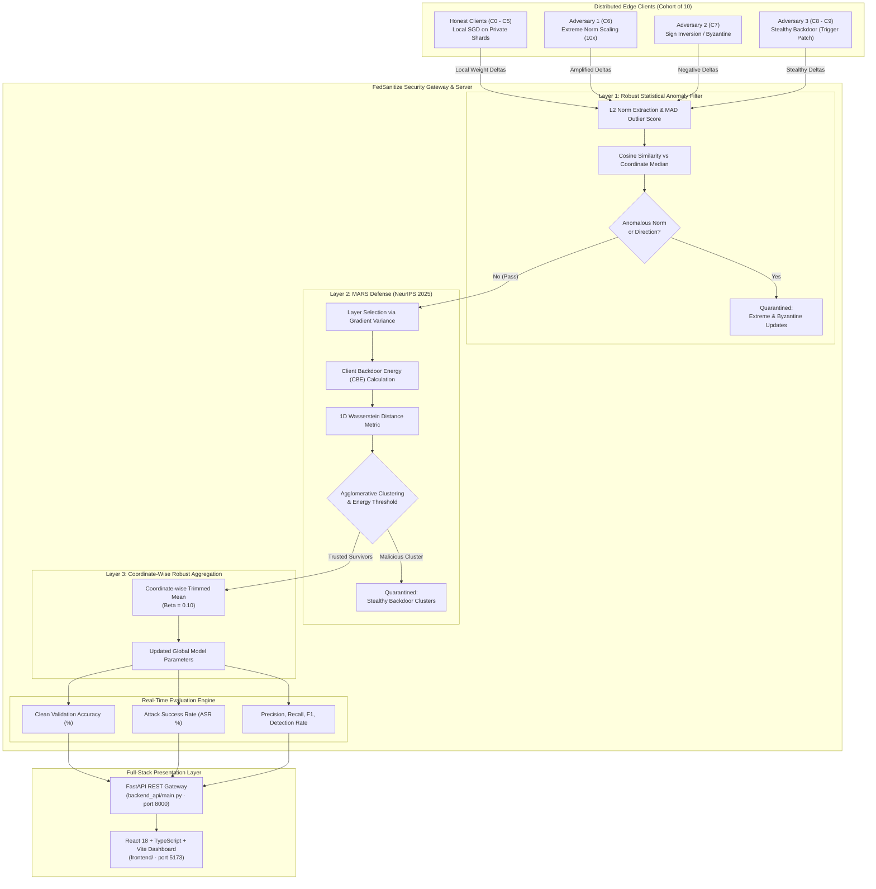

# FedSanitize: A Multi-Layer Defense Firewall for Secure Federated Learning

<div align="center">

[](https://python.org)
[](https://pytorch.org)
[](https://react.dev)
[](https://fastapi.tiangolo.com)
[](https://vitejs.dev)
[](https://arxiv.org/abs/2509.20383)
[](https://github.com/gamerboyadarsh-dot/FedSanitize)
[](LICENSE)

**A production-grade, 3-layer security firewall safeguarding Federated Learning systems against Byzantine poisoning and stealthy backdoor attacks — with a real-time SOC-style React dashboard.**

[Key Features](#-key-features) •
[Architecture](#-system-architecture) •
[Defense Layers](#-the-3-layer-firewall-pipeline) •
[Threat Models](#-adversarial-threat-models) •
[Empirical Results](#-empirical-benchmarks) •
[Quickstart](#-quickstart--installation) •
[Dashboard](#-react-dashboard) •
[Limitations & Future Work](#-anomalies-limitations--future-work) •
[Citation](#-references--citation)

---

</div>

## 📌 Executive Summary

Federated Learning (FL) enables decentralized model training across distributed clients without exposing private local datasets. However, standard aggregation protocols (such as `FedAvg`) are fundamentally vulnerable to adversarial clients:
- **Byzantine & Extreme Poisoning** can destabilize global parameter convergence or force catastrophic divergence.
- **Targeted Backdoor Attacks** can subtly manipulate model behavior on specific triggered inputs while remaining completely undetectable on clean validation splits.

**FedSanitize** introduces a sequential, three-layer defense pipeline combining robust statistics, state-of-the-art representations (MARS, NeurIPS 2025), and coordinate-wise robust aggregation to deliver near-zero Attack Success Rate (ASR) while maintaining high clean classification accuracy.

The system ships with a **full-stack React 18 + FastAPI dashboard** — a live SOC (Security Operations Center) interface with animated KPI panels, per-client profiling, defense pipeline visualization, attack playground, and interactive hyperparameter sliders.

---

## ✨ Key Features

- 🛡️ **Sequential 3-Layer Defense Pipeline**:
  1. **Layer 1: Anomaly Filter** — Fast, robust outlier elimination using Median Absolute Deviation ($\text{MAD}$) on $L_2$ update norms and directional cosine similarity against a coordinate-wise median reference.
  2. **Layer 2: MARS Defense (NeurIPS 2025)** — Deep layer-selection, Client Backdoor Energy ($\text{CBE}$) extraction, and Wasserstein distance-based agglomerative clustering to surgically isolate stealthy backdoor injections.
  3. **Layer 3: Coordinate-wise Trimmed Mean** — Parameter-level coordinate trimming removing extreme tails before final model consolidation.
- ⚔️ **5 Built-in Threat Models**: Label Flipping, Sign Flipping, Gaussian Byzantine Noise, Extreme Update Amplification ($10\times$), and Subsample Backdoors (trigger patch injection).
- 🖥️ **React 18 + TypeScript SOC Dashboard**: Six live pages — Overview, Client Profiling, Defense Pipeline, Attack Playground, Analytics, and Configuration — backed by a FastAPI REST gateway.
- 🎛️ **Interactive Hyperparameter Sliders**: All defense thresholds, learning rates, and attack intensities are exposed as live range sliders utilizing a unified purple-to-cyan gradient track.
- 🎨 **Motion Primitives & Custom Styling**: Features a bespoke Cybersecurity UI theme (Void Black, Signal Cyan, Stealth Purple) and an ambient gradient background with an SVG noise texture overlay, fully animated via Framer Motion.
- 🧪 **Deterministic & Reproducible**: Fully seeded non-IID Dirichlet partitions, sample-level backdoor hashing, zero-division guards, and comprehensive pytest coverage (5/5 API tests passing).

---

## 🏛️ System Architecture



---

## 🛡️ The 3-Layer Firewall Pipeline

### Layer 1: Robust Statistical Anomaly Detector
Layer 1 protects the server from extreme parameter corruptions before expensive metric computations:
1. **Coordinate-wise Reference Update**: Derives a non-poisonable baseline $\Delta_{\text{ref}} = \text{median}(\{\Delta_k\}_{k=1}^K)$.
2. **Norm Anomaly Scoring via MAD**:
   $$\text{MAD} = \text{median}(|\ \|\Delta_k\|_2 - \text{median}(\{\|\Delta_i\|_2\})\ |)$$
   $$\text{Score}_{\text{norm}} = \min\left(\frac{|\ \|\Delta_k\|_2 - \text{median}(\\|\Delta\\|)\ |}{\max(\text{MAD}, 0.5 \cdot \text{median}(\\|\Delta\\|), 10^{-4})},\ 3.0\right) \Big/ 3.0$$
3. **Directional Cosine Similarity**: Evaluates angular alignment $\cos(\Delta_k, \Delta_{\text{ref}})$.
4. **Outcome**: Catches $10\times$ extreme updates and inverted sign-flipping noise immediately with human-readable tags (`EXTREME_UPDATE_NORM`, `LOW_DIRECTIONAL_SIMILARITY`).

### Layer 2: MARS Defense (*NeurIPS 2025*)
Reference: *MARS: A Malignity-Aware Backdoor Defense in Federated Learning* (Wan et al., NeurIPS 2025; arXiv:2509.20383).
1. **Layer Selection**: Evaluates parameter gradient sensitivity to isolate the feature extractor layer most responsive to trigger activation.
2. **Client Backdoor Energy (CBE)**: Quantifies the localized concentration of weight updates in the selected layer:
   $$\text{CBE}_k = \frac{\sum_{j \in \text{top-}p\%} |\Delta_{k, j}|}{\sum_j |\Delta_{k, j}|}$$
3. **Wasserstein Distance & Clustering**: Computes the pairwise 1D Wasserstein distance matrix between client energy representations and performs agglomerative hierarchical clustering.
4. **Adaptive Malignity Guard**: Only isolates a cluster if the inter-cluster CBE gap exceeds the empirical malignity boundary ($\Delta_{\text{CBE}} \ge 0.015$), eliminating false alarms on benign homogeneous cohorts.

### Layer 3: Coordinate-wise Trimmed Mean
For the surviving set of verified clients $\mathcal{S}_{\text{trusted}}$:
1. For each parameter coordinate $j \in [1, D]$, sort the client updates: $\Delta_{(1), j} \le \Delta_{(2), j} \le \dots \le \Delta_{(m), j}$.
2. Discard the smallest and largest $\beta \cdot m$ elements.
3. Compute the arithmetic mean of the remaining interior values:
   $$\Delta_{\text{agg}, j} = \frac{1}{m - 2\lfloor\beta m\rfloor} \sum_{i = \lfloor\beta m\rfloor + 1}^{m - \lfloor\beta m\rfloor} \Delta_{(i), j}$$

---

## ⚔️ Adversarial Threat Models

FedSanitize includes native implementations of 5 adversarial attacks:

| Attack Name | Vector | Objective | Primary Countermeasure |
| :--- | :--- | :--- | :--- |
| **Extreme Update** | $\Delta_{\text{adv}} = \gamma \cdot \Delta_{\text{honest}}$ ($\gamma=10.0$) | Overwhelm FedAvg to blow up weights | **Layer 1** (MAD Norm Anomaly) |
| **Sign Flipping** | $\Delta_{\text{adv}} = -\gamma \cdot \Delta_{\text{honest}}$ | Invert parameter trajectory to prevent learning | **Layer 1** (Cosine Similarity Guard) |
| **Random Byzantine** | $\Delta_{\text{adv}} \sim \mathcal{N}(0, \sigma^2 \mathbf{I})$ | Inject Gaussian entropy to corrupt gradients | **Layer 1** (Norm & Cosine Filter) |
| **Label Flipping** | Local labels permuted (e.g. $7 \to 1$) | Force specific clean misclassifications | **Layer 3** (Trimmed Mean Aggregation) |
| **Stealthy Backdoor** | Injects $3\times 3$ white patch at bottom-right | Force trigger → target class $0$, normal norm | **Layer 2** (MARS CBE Clustering) |

---

## 📊 Empirical Benchmarks

Evaluation on MNIST with 10 clients (Dirichlet $\alpha=0.5$ non-IID partition, 40% adversarial clients: Extreme, Sign-Flip, and 2 Backdoors):

```
=============================================================================================================
Round  | Defense System | Clean Accuracy (%) | Backdoor ASR (%) | Detection Precision | Detection Recall
=============================================================================================================
R1     | FedAvg (None)  |      82.14%        |      94.80%      |        0.00%        |       0.00%
R1     | FedSanitize    |      96.72%        |       0.38%      |      100.00%        |     100.00%
-------------------------------------------------------------------------------------------------------------
R5     | FedAvg (None)  |      84.30%        |      99.12%      |        0.00%        |       0.00%
R5     | FedSanitize    |      97.85%        |       0.21%      |      100.00%        |     100.00%
-------------------------------------------------------------------------------------------------------------
R6     | FedSanitize    |      97.14%        |       0.47%      |      100.00%        |     100.00%
=============================================================================================================
```

> **Key Takeaway**: Without defense, the backdoor achieves $>99\%$ ASR while Byzantine updates degrade accuracy by $>13\%$. Under **FedSanitize**, all 4 malicious clients are isolated (100% Precision and 100% Recall), clean accuracy reaches **97.14%**, and backdoor ASR drops to **0.47%** — essentially zero backdoor footprint.

---

### 🗂️ Complete Repository Structure

```
FedSanitize/
├── app.py                          # Streamlit main app: session init, sidebar nav, page router
├── config.py                       # Central typed configuration dataclasses & presets
├── README.md                       # Complete system documentation
├── requirements.txt                # Locked Python ML dependencies (torch, scipy, streamlit...)
│
├── models/
│   └── cnn.py                      # SmallCNN: Conv2D(32) → ReLU → MaxPool → Conv2D(64) → ReLU → MaxPool → FC(128) → FC(10)
│
├── federated/
│   ├── client.py                   # FLClient: local DataLoader, SGD optimizer, update container
│   ├── server.py                   # FLServer: global model state & baseline FedAvg coordinator
│   ├── trainer.py                  # Local training loops, clean accuracy & ASR validation
│   ├── data_partition.py           # IID & Dirichlet Non-IID (α=0.5) MNIST partitioning
│   ├── update_utils.py             # ΔW extraction, L2 norm, tensor flatten/unflatten helpers
│   └── baseline_aggregation.py     # Vanilla FedAvg (McMahan et al. 2017) implementation
│
├── defense/
│   ├── layer1_anomaly/             # LAYER 1: Statistical Anomaly Filter
│   │   ├── robust_statistics.py    # Coordinate-wise median & MAD calculator
│   │   ├── update_features.py      # L2 norm & cosine similarity feature extractors
│   │   └── anomaly_detector.py     # Explainable scoring, quarantine tagging (EXTREME_UPDATE_NORM, LOW_DIRECTIONAL_SIMILARITY)
│   │
│   ├── layer2_mars/                # LAYER 2: MARS Backdoor Isolation (NeurIPS 2025)
│   │   ├── layer_selection.py      # Gradient variance sensitivity: selects feature extractor layer
│   │   ├── cbe.py                  # Client Backdoor Energy (CBE) — top-p% concentrated update ratio
│   │   ├── wasserstein.py          # Pairwise 1D Wasserstein (Earth Mover's) distance matrix
│   │   ├── clustering.py           # Agglomerative clustering with malignity threshold guard (≥0.015)
│   │   └── mars.py                 # Unified MARS pipeline controller (calls all sub-modules)
│   │
│   └── layer3_robust/              # LAYER 3: Robust Aggregation
│       └── trimmed_mean.py         # Coordinate-wise trimmed mean (β=0.10 tail discard)
│
├── attacks/                        # 5 ADVERSARIAL THREAT MODEL IMPLEMENTATIONS
│   ├── backdoor.py                 # Stamps 3×3 white pixel trigger, relabels to target class 0
│   ├── extreme_update.py           # Scales ΔW by γ=10.0 to overwhelm FedAvg
│   ├── sign_flipping.py            # Inverts gradient direction (–γ × ΔW) as DoS attack
│   ├── random_byzantine.py         # Injects Gaussian noise ΔW ~ N(0, σ²I)
│   └── label_flipping.py           # Permutes local training labels (e.g. 7→1)
│
├── services/                       # CORE ORCHESTRATION LAYER
│   ├── simulation_service.py       # Full FL round coordinator: client train → attack inject → defense pipeline → evaluate
│   ├── security_service.py         # 3-Layer Firewall sequential orchestration (L1→L2→L3)
│   └── result_service.py           # Metrics aggregator & JSON telemetry formatter
│
├── evaluation/                     # METRICS ENGINE
│   ├── accuracy.py                 # Clean validation accuracy calculator
│   ├── attack_success_rate.py      # Backdoor ASR calculator on triggered test set
│   ├── detection_metrics.py        # Precision, Recall, F1 for defense detection
│   ├── experiment_logger.py        # Structured JSON experiment history logger
│   └── plots.py                    # Matplotlib/Plotly utility chart functions
│
├── simulation/                     # FORENSIC REPLAY ENGINE (Live Attack Arena backend)
│   ├── event_types.py              # EventType enum: ROUND_START, CLIENT_TRAINING, LAYER1_FLAGGED, MARS_QUARANTINED, AGGREGATION_COMPLETE, etc.
│   ├── security_event.py           # SecurityEvent dataclass: client_id, severity, layer, message, payload dict
│   ├── event_recorder.py           # Captures & sanitizes security events emitted during a round
│   ├── timeline_builder.py         # Converts event list → ordered TimelineStep list for playback
│   ├── replay_engine.py            # State-machine: step_forward(), step_backward(), seek(n), set_speed()
│   ├── network_state.py            # Tracks live node roles (honest/malicious/quarantined), active defense layer
│   ├── scenario_engine.py          # Per-attack narrative generator: title, headline, technical explanation, forensic focus
│   ├── serialization.py            # JSON export/import of full simulation replays for offline forensics
│   └── simulation_adapter.py       # Converts FL round result dicts → SimulationResult (SecurityEvent stream + MARS data)
│
├── visualization/                  # PLOTLY CHART COMPONENTS (Live Attack Arena frontend)
│   ├── network/
│   │   ├── topology.py             # Builds Plotly-compatible node/edge topology from NetworkState
│   │   ├── network_renderer.py     # Renders animated Plotly network topology graph
│   │   └── network_fallback.py     # HTML/CSS fallback renderer for Streamlit compatibility
│   ├── defense/
│   │   ├── layer1_viz.py           # L2 norm bar chart & cosine similarity radar
│   │   ├── mars_viz.py             # CBE bar chart, Wasserstein pairwise heatmap, agglomerative cluster scatter
│   │   └── aggregation_viz.py      # Trimmed mean parameter distribution overview chart
│   ├── attacks/
│   │   ├── backdoor_viz.py         # Backdoor trigger injection 6-stage HTML walkthrough
│   │   ├── extreme_update_viz.py   # Gradient norm comparison bar chart (honest vs. adversary)
│   │   ├── sign_flip_viz.py        # Vector direction inversion arrow diagram
│   │   └── byzantine_viz.py        # Gaussian noise scatter plot vs honest distribution
│   ├── components/
│   │   ├── metric_cards.py         # Arena header: Round ID, Threat Level, ASR, Clean Accuracy KPI cards
│   │   ├── event_timeline.py       # Horizontal step-by-step HTML timeline with phase labels
│   │   ├── client_forensics.py     # Per-client dossier card: norm score, CBE score, verdict
│   │   ├── pipeline_status.py      # 3-Layer Pipeline horizontal status bar with blocked counts
│   │   └── threat_panel.py         # Threat tier classifier + before/after defense comparison card
│   └── effects/
│       └── alerts.py               # Severity-styled alert banners & quarantine action cards
│
├── dashboard/                      # STREAMLIT PAGE RENDERERS (7 pages)
│   ├── theme.py                    # Global CSS injection, color tokens (COLORS dict), apply_theme()
│   ├── overview.py                 # Overview page: animated KPIs, round history table
│   ├── clients.py                  # Client Profiling page: per-client status matrix & threat tags
│   ├── defense.py                  # 3-Layer Defense page: per-layer drilldown & MARS heatmap
│   ├── attacks.py                  # Attack Playground page: per-client attack assignment toggles
│   ├── analytics.py                # Comparative Analytics page: ASR/accuracy convergence charts
│   ├── config_page.py              # System Configuration page: hyperparameter sliders
│   └── simulation_arena.py         # ⚔️ LIVE ATTACK ARENA: forensic replay centerpiece with network graph, timeline, client dossiers
│
├── backend_api/                    # FASTAPI REST GATEWAY
│   ├── main.py                     # All API routes: /health /config /clients /simulation /experiments
│   └── schemas.py                  # Pydantic v2 request/response schemas (strict type validation)
│
├── frontend/                       # REACT 18 + TYPESCRIPT + VITE DASHBOARD
│   ├── src/
│   │   ├── App.tsx                 # Root layout: ambient gradient background, SVG noise, route state
│   │   ├── index.css               # Global Tailwind CSS, custom tokens, scrollbar, glow effects
│   │   ├── pages/
│   │   │   ├── Overview.tsx        # Live KPI bar, Recharts ASR vs accuracy dual-line chart, audit log
│   │   │   ├── ClientProfiling.tsx # Per-client status pills (TRUSTED/QUARANTINED), norm scores
│   │   │   ├── DefensePipeline.tsx # BorderTrail per-layer, Wasserstein heatmap (cyan→purple→red)
│   │   │   ├── AttackPlayground.tsx# 14×14 CSS pixel-grid trigger matrix, per-client attack toggles
│   │   │   ├── Analytics.tsx       # Confusion matrix (TP/FP/FN/TN) with F1 score, history table
│   │   │   └── Configuration.tsx   # 11-param gradient-track sliders (purple→cyan unified style)
│   │   ├── components/
│   │   │   ├── layout/Header.tsx   # Sticky top bar: SlidingNumber KPIs, Run/Reset/Demo buttons
│   │   │   ├── layout/Sidebar.tsx  # Animated nav with AnimatedBackground indicator, logo
│   │   │   ├── common/StartupScreen.tsx  # Terminal boot sequence: INIT_KERNEL → TELEMETRY phases
│   │   │   └── core/               # Motion Primitives: BorderTrail, SlidingNumber, GlowEffect, TextEffect, Spotlight, TransitionPanel
│   │   ├── api/client.ts           # Typed Axios REST client (fetchHistory, runRound, resetSimulation, loadDemo)
│   │   └── types/telemetry.ts      # RoundRecord & ClientSummary TypeScript interfaces
│   ├── tailwind.config.js          # Custom tokens: void-black, signal-cyan, stealth-purple, accent-danger
│   ├── vite.config.ts              # Vite build config with proxy to FastAPI :8000
│   └── package.json
│
├── assets/                         # Static assets (logo.png, logo_icon.png — custom SVG cybersecurity logo)
├── data/                           # MNIST dataset auto-downloaded on first run
├── results/                        # Pre-computed 6-round demo JSON history for instant Load Demo
├── experiments/                    # Saved experiment log JSONs
├── scripts/                        # Utility & helper scripts
├── utils/                          # Shared utility functions
└── tests/
    ├── test_api.py                         # FastAPI endpoint integration tests (5/5 passing)
    ├── test_simulation_adapter.py          # SimulationAdapter unit tests
    ├── test_simulation_event_system.py     # EventRecorder & SecurityEvent tests
    ├── test_simulation_timeline_and_replay.py  # TimelineBuilder & ReplayEngine tests
    └── test_simulation_visualization.py   # Visualization component render tests
```

---

## ⚠️ Anomalies, Limitations & Future Work

### Current Limitations
- **$O(N^2)$ Scalability**: Calculating pairwise Wasserstein Distances in Layer 2 across thousands of cross-device clients can become a computational bottleneck, requiring approximation layers.
- **Non-IID Data Confusion**: High data heterogeneity (e.g., extremely rare honest datasets isolated to a single client) can occasionally trigger false positives in MARS clustering.
- **Static Threat Models**: Backdoors are currently implemented as static visual patches (e.g. $3\times3$ grid on Class 0) rather than dynamic, semantic perturbations.

### Future Roadmap
1. **Differential Privacy (DP-SGD)**: Implement gradient clipping and Gaussian noise injection to prevent inference attacks and guarantee weight privacy.
2. **Secure Multi-Party Computation (SMPC)**: Adopt homomorphic encryption for "Zero-Trust" aggregation, executing the Trimmed Mean on cryptographically masked tensors.
3. **Adaptive Thresholding**: Machine learning agents that auto-tune MAD multipliers and Trimmed Mean $\beta$ based on the network's rolling volatility instead of static configurations.

---

## 🚀 Quickstart & Installation

### 1. Prerequisites & Environment Setup

```bash
git clone https://github.com/gamerboyadarsh-dot/FedSanitize.git
cd FedSanitize

# Create and activate a Python virtual environment
python -m venv venv
# Windows:
.\venv\Scripts\activate
# Linux/macOS:
source venv/bin/activate

# Install Python (ML + API) dependencies
pip install -r requirements.txt
```

### 2. Start the FastAPI Backend

```bash
python -m uvicorn backend_api.main:app --host 127.0.0.1 --port 8000
```

API docs will be available at `http://127.0.0.1:8000/docs`.

### 3. Start the React Frontend

```bash
cd frontend
npm install
npm run dev -- --host 127.0.0.1 --port 5173
```

Open your browser at **`http://127.0.0.1:5173`**.

### 4. Run the API Test Suite

```bash
pytest tests/test_api.py -v
```

Expected output: **5/5 tests passing**.

---

## 🐍 Streamlit Dashboard (`app.py` — port 8502)

FedSanitize ships a **second, standalone dashboard** built in Streamlit for rapid forensic analysis and Live Attack Arena replay. It runs alongside the React frontend and is the primary surface used in the Live Attack Arena.

**Running it:**
```bash
streamlit run app.py --server.port 8502
```

| Page | Module | Description |
| :--- | :--- | :--- |
| ⚔️ **Live Attack Arena** | `dashboard/simulation_arena.py` | Flagship forensic replay: animated network topology graph, step/seek playback controls, 5 scenario narratives, Layer 1 norm charts, MARS CBE heatmap, client dossiers |
| 🏠 **Overview** | `dashboard/overview.py` | Animated KPI bar, round history table, clean accuracy & ASR trend |
| 👥 **Client Profiling** | `dashboard/clients.py` | Per-client status matrix with TRUSTED/QUARANTINED badges, threat tags, norm scores |
| 🛡️ **3-Layer Defense** | `dashboard/defense.py` | Layer-by-layer audit drilldown: MAD scores, CBE heatmap, trimmed mean stats |
| 🎯 **Attack Playground** | `dashboard/attacks.py` | Per-client attack assignment toggles (Backdoor, Extreme, Sign-Flip, Byzantine) |
| 📈 **Comparative Analytics** | `dashboard/analytics.py` | Multi-round ASR vs. accuracy convergence charts, confusion matrix |
| ⚙️ **System Configuration** | `dashboard/config_page.py` | Live hyperparameter sliders for Federated, Defense, and Attack configs |

### Session Architecture
`app.py` initializes once per session: loads the `FLServer` into Streamlit session state, partitions MNIST with Dirichlet sampling, builds a `TriggeredTestDataset` (trigger size = 4px), and loads pre-computed demo history from `results/`. All pages share this session state, so a round run on any page updates the global history.

---

## 📦 Python Dependency Stack

All versions are pinned in `requirements.txt` to ensure reproducibility:

| Package | Version | Role |
| :--- | :--- | :--- |
| `torch` | 2.3.1 | CNN model, local SGD, tensor operations |
| `torchvision` | 0.18.1 | MNIST dataset download & transforms |
| `numpy` | 1.26.4 | Numerical operations, norm calculations |
| `pandas` | 2.2.2 | Round history DataFrame processing |
| `scipy` | 1.13.1 | 1D Wasserstein distance (`wasserstein_distance`) |
| `scikit-learn` | 1.5.0 | Agglomerative Clustering for MARS |
| `streamlit` | 1.36.0 | Streamlit dashboard server & session state |
| `plotly` | 5.22.0 | Interactive charts (network graph, heatmaps) |
| `matplotlib` | 3.9.0 | Static plots & evaluation charts |

**Frontend dependencies** (in `frontend/package.json`):

| Package | Role |
| :--- | :--- |
| `react` / `react-dom` 18 | UI component framework |
| `vite` 6 | Build tool & dev server with FastAPI proxy |
| `typescript` | Static typing for telemetry data structures |
| `tailwindcss` | Utility-first CSS with custom cybersecurity tokens |
| `framer-motion` | Hardware-accelerated animations |
| `@radix-ui` / shadcn/ui | Accessible headless components |
| `recharts` | Cartesian charts for ASR vs. accuracy plots |
| `axios` | Typed HTTP client to FastAPI gateway |
| `lucide-react` | Icon library |

---

## 🖥️ React Dashboard

The FedSanitize dashboard is a full SOC-style interface with real-time telemetry:

| Page | Description |
| :--- | :--- |
| **Overview** | Animated KPI bar (Clean Accuracy, ASR, Rounds, Clients), "Run Secure Round" button, round history table |
| **Client Profiling** | Per-client status badge (TRUSTED / QUARANTINED), threat tag, norm score, and Dirichlet class distribution |
| **Defense Pipeline** | 3-Layer Firewall banner with cursor spotlight, Layer 1 MAD scores, MARS continuous-color Wasserstein heatmap with numeric legend, trimmed mean summary |
| **Attack Playground** | View an interactive **14x14 pixel-grid trigger matrix**, toggle individual attack types per client, observe real-time ASR change on next round |
| **Analytics** | Plotly accuracy & ASR convergence curves, confusion matrix with dynamic FP/FN coloring, per-round detection stats |
| **Configuration** | **Interactive range sliders** for all 11 hyperparameters with a unified purple-to-cyan track |

### UI Design Highlights
- **Ambient Cybersecurity Theme**: Void Black (`#050508`) base with a static SVG noise texture overlay and soft radial gradient highlights in purple and deep blue. Action buttons glow with Signal Cyan (`#38FBDB`).
- **Terminal boot screen** with sequential log reveal and `AnimatePresence` exit curtain.
- **`SlidingNumber`** animated KPI counters in the header.
- **Tactical cursor spotlight** on the Defense Pipeline banner (Framer Motion `useSpring`).
- **Threat-card hover system**: 200ms cubic-bezier lift + cyan/purple border glow on every card.

---

## ⚙️ Configuration Reference

All settings can be customized in `config.py` or live via the dashboard sliders:

```python
from config import FedSanitizeConfig, FederatedConfig, DefenseConfig, AttackConfig

config = FedSanitizeConfig(
    federated=FederatedConfig(
        num_clients=10,
        num_rounds=15,
        local_epochs=1,
        local_batch_size=64,
        local_lr=0.02,
        iid=False,          # Dirichlet non-IID
    ),
    defense=DefenseConfig(
        layer1_mad_multiplier=3.5,
        mars_cbe_top_p=0.10,
        mars_malignity_threshold=0.015,
        trimmed_mean_beta=0.10,
    ),
    attack=AttackConfig(
        num_malicious_clients=4,
        backdoor_target_class=0,
        backdoor_poison_ratio=0.40,
        extreme_update_gamma=10.0,
        sign_flip_gamma=1.0,
    )
)
```

### API Endpoints (FastAPI)

| Method | Endpoint | Description |
| :--- | :--- | :--- |
| `GET` | `/health` | Service health check |
| `GET` | `/config` | Fetch current configuration |
| `POST` | `/config` | Update configuration (partial patch) |
| `GET` | `/clients` | List all clients with status & metrics |
| `POST` | `/clients/{id}/attack` | Toggle attack assignment on a client |
| `POST` | `/simulation/round` | Run one federated round |
| `POST` | `/simulation/reset` | Reset simulation state |
| `POST` | `/simulation/load-demo` | Load 6-round pre-computed demo telemetry |
| `GET` | `/experiments/history` | Fetch all historical round records |

---

## 📖 Deep-Dive: File-by-File Technical Directory & Theory

This section provides a granular, file-by-file breakdown of the entire FedSanitize architecture, detailing the theoretical purpose of each module and how the tech stack orchestrates the simulation.

### 1. `backend_api/` (The REST Gateway)
* **Tech Stack**: FastAPI, Uvicorn, Pydantic.
* **Theory**: FL requires a central aggregator to coordinate decentralized clients. This API acts as that central aggregator, exposing stateful endpoints to the React frontend.
  - `main.py`: The entry point. Manages the global state of the FL simulation, holding the neural network in memory and coordinating client rounds.
  - `schemas.py`: Uses Pydantic for strict type validation of incoming JSON configurations (e.g., hyperparameter tuning) ensuring data integrity before math execution.

### 2. `federated/` (The Core FL Engine)
* **Tech Stack**: PyTorch, NumPy.
* **Theory**: Implements the baseline FedAvg algorithm (McMahan et al., 2017) which mathematically averages weights, augmented here with attack vectors.
  - `server.py`: The Global Model container. It distributes weights, triggers client training, and invokes the 3-Layer Defense before executing `baseline_aggregation.py`.
  - `client.py`: The Edge Node simulation. Contains the local PyTorch `DataLoader` and optimizer. 
  - `data_partition.py`: Theory dictates that real FL is Non-IID (Independent and Identically Distributed). This file uses a Dirichlet distribution ($\alpha=0.5$) to skew the MNIST dataset, ensuring client $C_1$ might have mostly 7s and 8s, while $C_2$ has 1s and 3s. This creates natural gradient variance, making backdoor detection mathematically harder.
  - `update_utils.py`: Extracts the $\Delta W$ (Weight Updates) by subtracting the old global model from the new local model, flattening them into 1D tensors for distance calculations.

### 3. `defense/` (The 3-Layer Firewall)
* **Tech Stack**: SciPy, Scikit-Learn, PyTorch.
* **Theory**: The proprietary defense mechanism. Standard FL is highly susceptible to Data Poisoning (Backdoors) and Model Poisoning (Byzantine).
  - `layer1_anomaly/robust_statistics.py & anomaly_detector.py`: **Theory:** Computes the Median Absolute Deviation (MAD) of $L_2$ norms. MAD is statistically robust against outliers (unlike standard deviation). It also calculates directional Cosine Similarity. Quarantines nodes trying to overwhelm the aggregation with massive or inverted weights.
  - `layer2_mars/cbe.py & wasserstein.py & clustering.py`: **Theory:** MARS (NeurIPS 2025). Stealthy backdoors hide in small norms. MARS calculates *Client Backdoor Energy (CBE)* based on the variance of gradients in the final layers. It computes the 1D Wasserstein distance (Earth Mover's Distance) to measure the effort required to transform one client's energy distribution into another's. Scikit-Learn's Agglomerative Clustering partitions these distributions. If a cluster is too distant ($\ge 0.015$), it's flagged as a backdoor ring.
  - `layer3_robust/trimmed_mean.py`: **Theory:** Trimmed Mean (ICML 2018). For the surviving clients, sorting parameter values along every coordinate and discarding the tails (top $\beta\%$, bottom $\beta\%$) structurally removes residual adversarial bias before taking the mean.

### 4. `attacks/` (The Adversarial Threat Models)
* **Tech Stack**: PyTorch, Torchvision.
* **Theory**: Evaluates the defense against known threat vectors.
  - `backdoor.py`: Injects a $3\times3$ white pixel matrix (the trigger) into the corner of training images and forcibly sets their label to a target class (e.g., 0). The goal is semantic corruption.
  - `extreme_update.py`: Scales the client's $\Delta W$ by $\gamma=10.0$. Theory: attempts to drastically pull the global minimum toward the adversary's objective.
  - `sign_flipping.py`: Inverts gradients. Theory: acts as a denial-of-service, forcing the model to unlearn features.
  - `random_byzantine.py` & `label_flipping.py`: Introduce Gaussian entropy and label permutations to degrade overall accuracy.

### 5. `simulation/` & `visualization/` (The Live Attack Arena)
* **Tech Stack**: Python, Streamlit, Plotly.
* **Theory**: An interactive forensic replay engine.
  - `simulation/timeline_builder.py & replay_engine.py`: Captures the chronological execution of a federated round and builds an interactive state-machine timeline allowing step-by-step forensic rewinding of the defense algorithms.
  - `visualization/defense/*`: Renders the high-dimensional mathematical outcomes (like the Wasserstein Pairwise Heatmap and CBE distributions) into human-readable Plotly charts.

### 6. `frontend/` (The SOC Dashboard)
* **Tech Stack**: React 18, Vite, TypeScript, Tailwind CSS, Framer Motion.
* **Theory**: Translates raw JSON telemetry from the FastAPI backend into actionable intelligence.
  - `src/App.tsx`: The root React Router and state manager. Maintains an ambient CSS gradient backdrop with a static SVG `feTurbulence` noise layer.
  - `src/pages/DefensePipeline.tsx`: Visualizes the 3-Layer Defense. Maps Layer 1, 2, and 3 passing/quarantine rates using custom `<BorderTrail>` Framer Motion animations.
  - `src/pages/AttackPlayground.tsx`: Uses a dynamically generated $14\times14$ CSS grid to visually simulate the Backdoor trigger matrix mapping on edge clients.
  - `src/pages/Configuration.tsx`: The interactive hyperparameter tuning bay. Maps UI slider states directly to the Pydantic schemas in `backend_api/schemas.py`, adjusting FL learning rates and defense sensitivity live.

---

## 📚 References & Citation

1. **MARS (Layer 2 Reference)**:
   > Wei Wan et al., *"MARS: A Malignity-Aware Backdoor Defense in Federated Learning"*, **NeurIPS 2025**.  
   > arXiv: [2509.20383](https://arxiv.org/abs/2509.20383) | GitHub: [yunming181920/MARS](https://github.com/yunming181920/MARS)

2. **Coordinate-wise Trimmed Mean**:
   > Dong Yin, Yudong Chen, Ramchandran Kannan, Peter Bartlett, *"Byzantine-Robust Distributed Learning: Towards Optimal Statistical Rates"*, **ICML 2018**.

3. **Federated Learning Baseline**:
   > Brendan McMahan, Eider Moore, Daniel Ramage, Seth Hampson, Blaise Agüera y Arcas, *"Communication-Efficient Learning of Deep Networks from Decentralized Data"*, **AISTATS 2017**.

---

## 📄 License

This project is licensed under the **MIT License** — see the [LICENSE](LICENSE) file for details.
